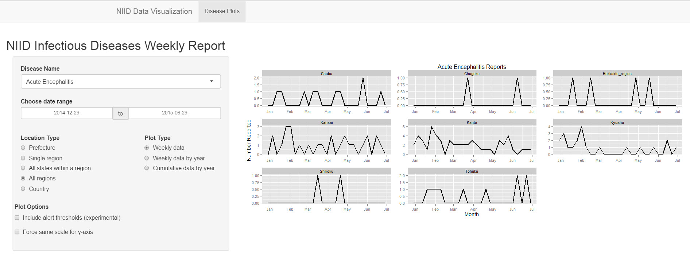
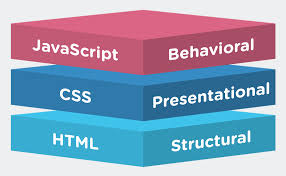
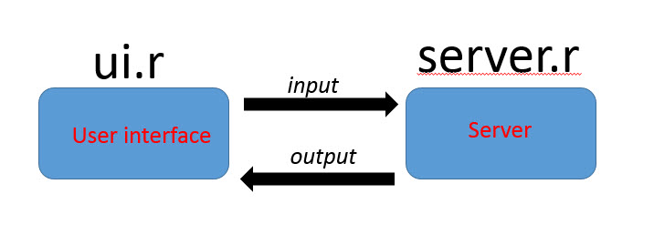
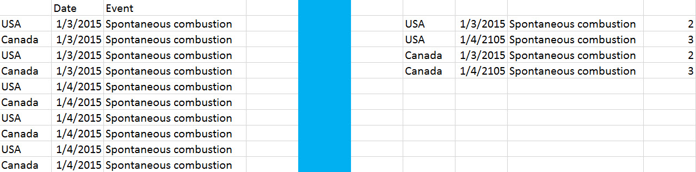

\newpage

# Why use the **shiny** package from RStudio?

**Use the command line to analyze my data?**

**Pointing and clicking.**

\newpage

#Example of a Shiny application  

\newpage

# Why use the **shiny** package from RStudio?

Can use fancy terms like **HTML, CSS, Javascript** but let R do all the work with wrapper functions

\newpage

# The components of a Shiny app 

\newpage

# Inspiration for this session

http://shiny.rstudio.com/tutorial/

The URL points to a 2.25 hour video as well as 7 lessons that we quickly work through here.

- Lesson 1 - Welcome to Shiny
-	Lesson 2 - Layout the user interface
-	Lesson 3 - Add control widgets
-	Lesson 4 - Display reactive output
-	Lesson 5 - Use R scripts and data

\newpage

# Install the **shiny** package

**install.packages('shiny')**

Then find where the package lives to access source code for examples

Change your working directory 

**setwd("~/R/win-library/3.2/shiny/examples")**

\newpage

# Inspiration for this session

http://shiny.rstudio.com/tutorial/
\vspace{5mm}

The URL points to a 2.25 hour video as well as 7 lessons.
\vspace{5mm}

**We will now watch the entire thing**
\vspace{5mm}

- Lesson 1 - Welcome to Shiny
-	Lesson 2 - Layout the user interface
-	Lesson 3 - Add control widgets
-	Lesson 4 - Display reactive output
-	Lesson 5 - Use R scripts and data
- Lesson 6 - Use reactive expressions
- Lesson 7 - Share your apps

\newpage

# How to make it for a easy for anybody to use your Shiny app

http://rstudio-pubs-static.s3.amazonaws.com/3269_a6682dfda37e411fb5e0e6699495cdc4.html

\newpage

# Ingestion of data into a Shiny app

How much pre-processing?

$\;$
$\;$
$\;$

